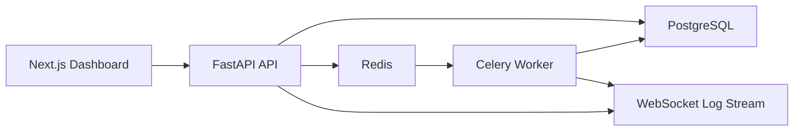

# AI SaaS Control Center


A production-style fullstack control center for AI SaaS operations. The product gives teams one place to manage AI agents, document processing, workflow automations, execution logs, analytics, API keys, team access, and audit trails.

This is built to feel like a real startup codebase: typed FastAPI services, SQLAlchemy 2.0 repositories, Alembic migrations, JWT auth, Redis-backed workers, a polished Next.js dashboard, and CI that runs linting plus tests.

## Product Scope

- JWT authentication with register, login, logout, and current-user APIs
- Workspace and team model with `owner`, `admin`, and `member` roles
- AI agent management with model settings, roles, status, and instructions
- Document upload API with validation, mock AI extraction, warnings, and statuses
- Workflow builder backend with ordered steps, manual runs, executions, and logs
- WebSocket endpoint for live execution updates
- Analytics endpoints for operational KPIs and execution volume
- API key creation/revocation with hashed keys only
- Audit logs for user, workspace, agent, document, workflow, and key actions
- Seed script for a demo workspace with realistic product data

## Architecture



The backend keeps business logic out of route handlers. Routes validate HTTP inputs, services enforce product behavior and permissions, repositories isolate database access, and workers handle long-running execution tasks.

## Tech Stack

| Layer | Tools |
| --- | --- |
| Frontend | Next.js 15, TypeScript, Tailwind CSS, shadcn-style components, React Hook Form, Zod, TanStack Query, Recharts |
| Backend | FastAPI, Python 3.11+, SQLAlchemy 2.0, Alembic, Pydantic, JWT |
| Data | PostgreSQL, Redis |
| Background jobs | Celery |
| Testing and quality | Pytest, Ruff, Black, GitHub Actions |
| DevOps | Docker, docker-compose, Makefile, `.env.example` |

## API Examples

Register:

```bash
curl -X POST http://localhost:8000/api/v1/auth/register \
  -H "Content-Type: application/json" \
  -d '{"email":"demo@acme.ai","password":"SecurePass123!","full_name":"Demo Operator"}'
```

Upload a document:

```bash
curl -X POST http://localhost:8000/api/v1/documents/upload \
  -H "Authorization: Bearer <token>" \
  -F "workspace_id=<workspace-id>" \
  -F "file=@invoice.txt;type=text/plain"
```

Run a workflow:

```bash
curl -X POST http://localhost:8000/api/v1/workflows/<workflow-id>/run \
  -H "Authorization: Bearer <token>"
```

Example extraction result:

```json
{
  "document_type": "invoice",
  "vendor_name": "Northstar AI Labs",
  "customer_name": "Demo Workspace",
  "invoice_number": "INV-2026-0428",
  "total_amount": 1299.0,
  "currency": "USD",
  "tax_amount": 246.81,
  "confidence_score": 0.93,
  "line_items": [
    {
      "description": "AI operations platform usage",
      "quantity": 1,
      "amount": 1299.0
    }
  ]
}
```

WebSocket logs:

```ts
const socket = new WebSocket("ws://localhost:8000/api/v1/executions/ws/<execution-id>");
socket.onmessage = (event) => console.log(JSON.parse(event.data));
```

## Dashboard Pages

- `/login` and `/register`
- `/dashboard` for KPIs, recent activity, charts, and live logs
- `/agents` for AI agent configuration
- `/documents` for uploads and extraction state
- `/workflows` for automation steps and manual runs
- `/executions` for execution history and log inspection
- `/analytics` for success rate, failures, throughput, and processing time
- `/api-keys` for key lifecycle management
- `/settings` for workspace and team controls

## Local Setup

```bash
cp .env.example .env
cd backend
python -m venv .venv
.venv\Scripts\activate
pip install -e ".[dev]"
alembic upgrade head
uvicorn app.main:app --reload
```

In another terminal:

```bash
cd frontend
npm install
npm run dev
```

Backend docs are available at `http://localhost:8000/docs`.

## Docker Setup

```bash
cp .env.example .env
docker compose up --build
```

Services:

- Frontend: `http://localhost:3000`
- Backend API: `http://localhost:8000`
- OpenAPI docs: `http://localhost:8000/docs`
- PostgreSQL: `localhost:5432`
- Redis: `localhost:6379`

## Demo Data

After migrations:

```bash
cd backend
python scripts/seed_demo.py
```

Demo credentials:

- Email: `demo@acme.ai`
- Password: `SecurePass123!`

## Tests

```bash
make test
make lint
```

Backend checks:

```bash
cd backend
ruff check .
black --check .
pytest
```

Frontend checks:

```bash
cd frontend
npm run lint
npm run typecheck
npm run build
```

## Folder Structure

```text
backend/
  app/
    api/routes/        FastAPI route modules
    core/              config, security, logging, exceptions
    db/                SQLAlchemy engine and base
    models/            database models
    repositories/      data access layer
    schemas/           Pydantic request/response models
    services/          product logic and permissions
    workers/           Celery app and task entrypoints
    websockets/        execution log connection manager
  alembic/             migrations
  tests/               pytest coverage

frontend/
  app/                 Next.js app router pages
  components/          dashboard, forms, layout, tables, charts, UI
  hooks/               TanStack Query hooks
  lib/                 API, auth, websocket, utilities
  types/               shared frontend types
```

## Why This Matters

AI SaaS products need more than a chat box. They need auth, workspaces, permissions, document pipelines, background execution, observability, billing-ready API keys, and interfaces operators can use every day. This project demonstrates those backend and frontend skills in one coherent product:

- API design and OpenAPI quality
- service/repository architecture
- async database access with migrations
- secure JWT auth and password hashing
- workspace-level authorization
- background jobs and realtime event delivery
- clean dashboard UX with typed frontend forms and charts
- CI-ready testing and formatting

## Screenshots

The dashboard is implemented as a full Next.js app. Add screenshots from `http://localhost:3000/dashboard` after running Docker or `npm run dev`.
