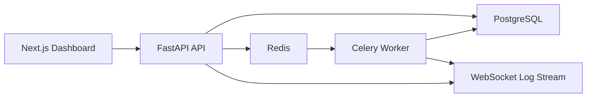
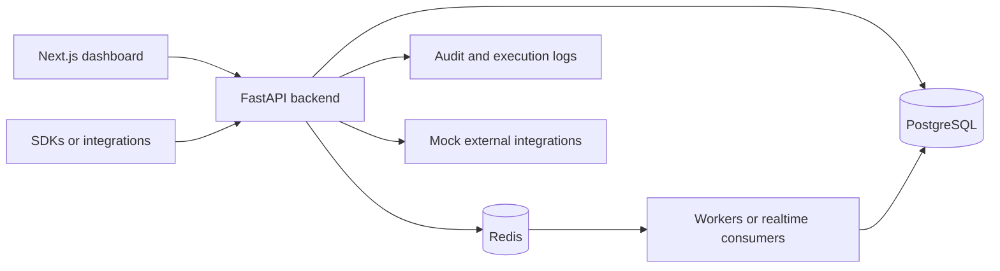
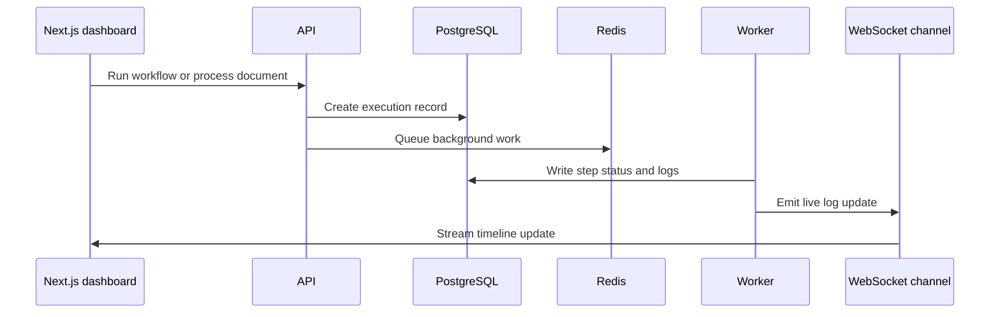

# AI SaaS Control Center


A production-style fullstack control center for AI SaaS operations. The product gives teams one place to manage AI agents, document processing, workflow automations, execution logs, analytics, API keys, team access, and audit trails.

This is built to feel like a real startup codebase: typed FastAPI services, SQLAlchemy 2.0 repositories, Alembic migrations, JWT auth, Redis-backed workers, a polished Next.js dashboard, and CI that runs linting plus tests.

## Product Scope

- JWT authentication with register, login, logout, and current-user APIs
- Workspace and team model with `owner`, `admin`, and `member` roles
- AI agent management with model settings, roles, status, and instructions
- Document upload API with validation, mock AI extraction, warnings, and statuses
- Workflow builder backend with ordered steps, manual runs, executions, and logs
- WebSocket endpoint for live execution updates
- Analytics endpoints for operational KPIs and execution volume
- API key creation/revocation with hashed keys only
- Audit logs for user, workspace, agent, document, workflow, and key actions
- Seed script for a demo workspace with realistic product data

## Architecture



The backend keeps business logic out of route handlers. Routes validate HTTP inputs, services enforce product behavior and permissions, repositories isolate database access, and workers handle long-running execution tasks.

## Tech Stack

| Layer | Tools |
| --- | --- |
| Frontend | Next.js 15, TypeScript, Tailwind CSS, shadcn-style components, React Hook Form, Zod, TanStack Query, Recharts |
| Backend | FastAPI, Python 3.11+, SQLAlchemy 2.0, Alembic, Pydantic, JWT |
| Data | PostgreSQL, Redis |
| Background jobs | Celery |
| Testing and quality | Pytest, Ruff, Black, GitHub Actions |
| DevOps | Docker, docker-compose, Makefile, `.env.example` |

## API Examples

Register:

```bash
curl -X POST http://localhost:8000/api/v1/auth/register \
  -H "Content-Type: application/json" \
  -d '{"email":"demo@acme.ai","password":"SecurePass123!","full_name":"Demo Operator"}'
```

Upload a document:

```bash
curl -X POST http://localhost:8000/api/v1/documents/upload \
  -H "Authorization: Bearer <token>" \
  -F "workspace_id=<workspace-id>" \
  -F "file=@invoice.txt;type=text/plain"
```

Run a workflow:

```bash
curl -X POST http://localhost:8000/api/v1/workflows/<workflow-id>/run \
  -H "Authorization: Bearer <token>"
```

Example extraction result:

```json
{
  "document_type": "invoice",
  "vendor_name": "Northstar AI Labs",
  "customer_name": "Demo Workspace",
  "invoice_number": "INV-2026-0428",
  "total_amount": 1299.0,
  "currency": "USD",
  "tax_amount": 246.81,
  "confidence_score": 0.93,
  "line_items": [
    {
      "description": "AI operations platform usage",
      "quantity": 1,
      "amount": 1299.0
    }
  ]
}
```

WebSocket logs:

```ts
const socket = new WebSocket("ws://localhost:8000/api/v1/executions/ws/<execution-id>");
socket.onmessage = (event) => console.log(JSON.parse(event.data));
```

## Dashboard Pages

- `/login` and `/register`
- `/dashboard` for KPIs, recent activity, charts, and live logs
- `/agents` for AI agent configuration
- `/documents` for uploads and extraction state
- `/workflows` for automation steps and manual runs
- `/executions` for execution history and log inspection
- `/analytics` for success rate, failures, throughput, and processing time
- `/api-keys` for key lifecycle management
- `/settings` for workspace and team controls

## Local Setup

```bash
cp .env.example .env
cd backend
python -m venv .venv
.venv\Scripts\activate
pip install -e ".[dev]"
alembic upgrade head
uvicorn app.main:app --reload
```

In another terminal:

```bash
cd frontend
npm install
npm run dev
```

Backend docs are available at `http://localhost:8000/docs`.

## Docker Setup

```bash
cp .env.example .env
docker compose up --build
```

Services:

- Frontend: `http://localhost:3000`
- Backend API: `http://localhost:8000`
- OpenAPI docs: `http://localhost:8000/docs`
- PostgreSQL: `localhost:5432`
- Redis: `localhost:6379`

## Demo Data

After migrations:

```bash
cd backend
python scripts/seed_demo.py
```

Demo credentials:

- Email: `demo@acme.ai`
- Password: `SecurePass123!`

## Tests

```bash
make test
make lint
```

Backend checks:

```bash
cd backend
ruff check .
black --check .
pytest
```

Frontend checks:

```bash
cd frontend
npm run lint
npm run typecheck
npm run build
```

## Folder Structure

```text
backend/
  app/
    api/routes/        FastAPI route modules
    core/              config, security, logging, exceptions
    db/                SQLAlchemy engine and base
    models/            database models
    repositories/      data access layer
    schemas/           Pydantic request/response models
    services/          product logic and permissions
    workers/           Celery app and task entrypoints
    websockets/        execution log connection manager
  alembic/             migrations
  tests/               pytest coverage

frontend/
  app/                 Next.js app router pages
  components/          dashboard, forms, layout, tables, charts, UI
  hooks/               TanStack Query hooks
  lib/                 API, auth, websocket, utilities
  types/               shared frontend types
```

## Why This Matters

AI SaaS products need more than a chat box. They need auth, workspaces, permissions, document pipelines, background execution, observability, billing-ready API keys, and interfaces operators can use every day. This project demonstrates those backend and frontend skills in one coherent product:

- API design and OpenAPI quality
- service/repository architecture
- async database access with migrations
- secure JWT auth and password hashing
- workspace-level authorization
- background jobs and realtime event delivery
- clean dashboard UX with typed frontend forms and charts
- CI-ready testing and formatting

## Screenshots

The dashboard is implemented as a full Next.js app. Add screenshots from `http://localhost:3000/dashboard` after running Docker or `npm run dev`.

<!-- lead-level-notes:start -->

## Lead-Level Architecture Notes

### Problem

AI SaaS teams often manage agents, documents, workflows, executions, API keys, analytics, and team access in separate tools. That slows debugging, onboarding, and operational reviews.

### Solution

This monorepo combines a FastAPI backend with a Next.js dashboard for managing AI agents, document processing, workflows, executions, realtime logs, analytics, API keys, and audit activity. The backend keeps business logic in services while the frontend presents operational workflows as a control center.

### Architecture Overview

This is a portfolio/simulation project, but it is structured around the same boundaries a production team would care about:

- Frontend/client: Next.js frontend.
- Backend API: FastAPI routes stay thin and delegate business rules to services.
- Database: PostgreSQL is the source of truth for relational state, ownership, and auditability.
- Redis: Used where the project needs queues, Pub/Sub, cache-ready paths, or rate-limit-ready primitives.
- Background jobs: Documents and workflows are processed out of band while WebSockets keep the UI responsive with live execution state.
- Integrations: Mock providers are kept behind service boundaries so real vendors can be added without changing API contracts.
- Runtime flow: Requests validate identity and tenant access first, then call services that persist state, emit logs, and enqueue async work when needed.

Key components:

- Next.js dashboard
- FastAPI backend API
- PostgreSQL for product and execution state
- Redis broker for worker tasks
- Worker for document and workflow processing
- WebSockets for realtime execution logs
- Mock AI services and API key management

### Mermaid Diagrams

#### System Overview



#### Execution Log Flow



### Lead-Level Engineering Decisions

- FastAPI keeps the API surface explicit, typed, and easy to document through OpenAPI.
- PostgreSQL is used for durable relational state because the core domain depends on ownership, filtering, constraints, and audit history.
- Service and repository layers keep route handlers small and make permission checks, workflows, and business rules easier to test.
- Redis is used for lightweight async coordination, Pub/Sub, cache-ready access patterns, or rate limiting depending on the product shape.
- Pydantic schemas define clear input/output contracts and avoid leaking ORM details into HTTP responses.
- Docker Compose keeps the local runtime close to a real deployment without hiding the moving parts.
- The project would need Kafka or another event stream when message volume, replay, ordering, or cross-service consumers outgrow Redis queues or Pub/Sub.
- Kubernetes would make sense once multiple API/worker replicas, autoscaling, secrets management, and rollout strategy become operational concerns.
- Object storage becomes necessary when user-uploaded files, exports, or artifacts should not live on local disk.

### Production Considerations

- Rate limiting should be applied to authentication, public ingestion, webhook, and API-key protected endpoints.
- Important POST endpoints should support idempotency keys when clients may retry after timeouts.
- Workers should record retry attempts, terminal failures, and enough context for support/debugging.
- Structured logging should include request IDs, actor IDs, tenant/workspace IDs, and resource IDs where safe.
- Health checks should distinguish process health from dependency readiness for database, Redis, and workers.
- Error responses should stay consistent and avoid leaking internal exception details.
- Pagination and filtering should be mandatory for list endpoints that can grow with customer usage.
- Validation should happen at the API boundary and again inside domain services for sensitive state transitions.
- Audit logs should be append-only from the application's point of view and easy to filter by actor/action/resource.

### Security Considerations

- JWT secrets and database credentials belong in environment variables or a secret manager, never in source code.
- Passwords should be hashed with a slow password hashing algorithm and never logged.
- API keys should be shown only once, stored hashed, scoped to the smallest useful surface, and revocable.
- RBAC or workspace membership checks should happen before returning or mutating tenant-owned resources.
- Tenant/workspace isolation should be tested with explicit cross-tenant access attempts.
- Input validation should cover request bodies, path parameters, uploaded files, and integration payloads.
- Safe defaults matter: deny by default, keep production actions stricter, and prefer explicit allow lists.
- The most important security boundary in this project is workspace permissions, JWT auth, and hashed API keys.

### Observability

- Request logs should capture method, path, status, latency, and correlation ID.
- Domain logs should capture state transitions such as queued, processing, completed, failed, revoked, or retried.
- Audit logs explain who changed what and when.
- Metrics/analytics endpoints provide a product-facing view of usage, failure rates, and operational health.
- `/health` gives a basic load balancer check; production would add dependency checks and build/version metadata.
- Error tracking can be mocked locally, but production should send exceptions to Sentry or a similar system.
- Realtime log streams, where present, are for operator feedback and should not replace persisted logs.

### Scaling Strategy

- MVP: one API instance, one PostgreSQL database, one Redis instance, and one worker process is enough to validate the product shape.
- Next step: run multiple API replicas, separate worker queues by workload, and add indexes for tenant ID, status, timestamps, and foreign keys.
- Caching: cache read-heavy reference data carefully and keep invalidation tied to writes or versioned configs.
- Queues: keep short jobs on Redis; move to Kafka, Redpanda, or a managed queue when replay, ordering, or long retention are needed.
- Database: use connection pooling, query plans, and read replicas before introducing unnecessary data stores.
- Horizontal scaling should preserve tenant isolation, idempotency, and clear ownership of background jobs.
- This system would most likely need a stronger event backbone when tenant growth across agents, documents, workflows, and realtime logs.

### Future Improvements

- Add hosted object storage for documents
- Add per-workspace AI cost budgets
- Add Sentry and OpenTelemetry across frontend and backend
- Kubernetes manifests or Helm charts once runtime topology matters.
- OpenTelemetry traces across API, workers, database calls, and external integrations.
- Sentry or another error tracker for production exception triage.
- Prometheus and Grafana dashboards for latency, queue depth, throughput, and failure rates.
- More contract and integration tests around permission boundaries and failure paths.

<!-- lead-level-notes:end -->
